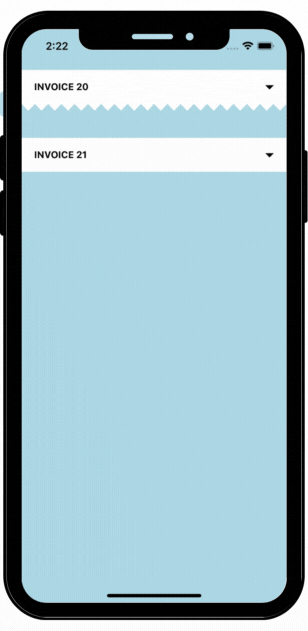
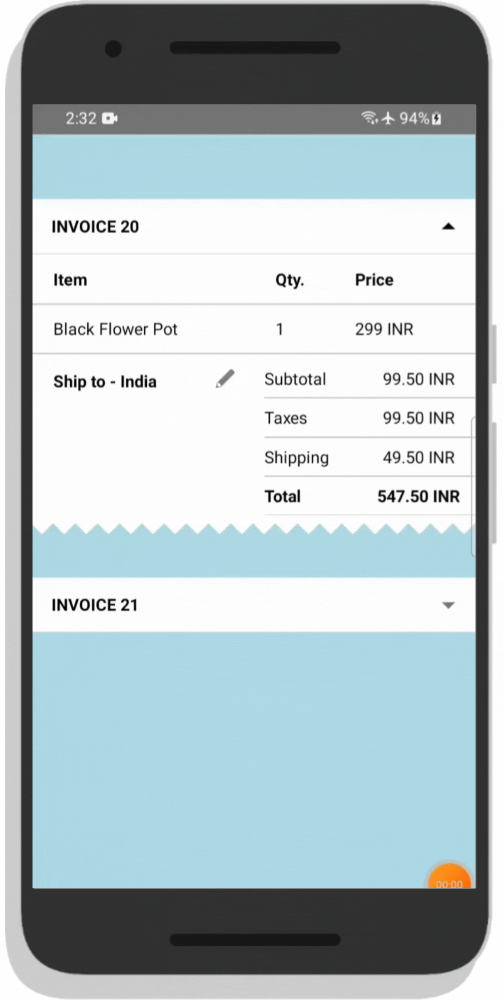

# React Native Collapsible Animated Invoice 🔥


[](https://www.npmjs.com/package/react-native-collapsible-invoice)

A simple and customizable React Native animataed invoice or list component. Perfect for the E-commerce applications to show the list of bills or invoice in the user orders section. 

## Example

## [Try this exapmple on Expo Snack ❤️](https://snack.expo.dev/@smartcoder0786/react-native-collapsible-invoice)

### --------------- ios ---------------  ------------- Android -------------



## Prerequisites

 ⚠️ Peer Dependencies

 * [react-native-vector-icons](https://www.npmjs.com/package/react-native-vector-icons)

This component has a peer dependency on react-native-vector-icons has to be installed and linked into your project.
Follow [react-native-vector-icons](https://www.npmjs.com/package/react-native-vector-icons) to install the dependency.

## Installation

Supported version: react-native >= 0.59.0

  ```bash
  npm install react-native-collapsible-invoice
  ```

## Example

#### contains code for one invoice


```jsx
...
import AnimatedInvoice from 'react-native-collapsible-invoice';
 
 const App = () => {
  return (
  ...
      <View>
        <AnimatedInvoice
          triangleNumbers={'20'}
          triangleHeight={10}
          barStyle={{ backgroundColor: 'white', }}
          triangleStyle={{ backgroundColor: 'white' }}
          trianglesWidth={300}
          iconColor={'black'}
          barComponent={ <Your Component/> }
        >
        </AnimatedInvoice>
       </View>
       ...
        )}
       
const styles = StyleSheet.create({

  container: {
      flex:1
   }
   
});

export default App;

```

## Props

| Prop                  | Description                                                                                 | Type                          | Default Value | Required |
| :--------------------:|:-------------------------------------------------------------------------------------------:|:-----------------------------:|:-------------:|:--------:|
| triangleNumbers       | Triangles you want at the bottom of the component                                           | Number                        | 0             | false    |
| triangleHeight        | Triangle Height                                                                             | Number                        | Best Fit  | false    |
| barStyle              | Bar Container Style                                                                         | ViewStyle                     | {}           | false    |
| triangleStyle         | Trianlge Style                                                                              | ViewStyle                     | {}           | false     |
| iconColor             | Color for the arrow up and down icons                                                       | String                        | black     | false    |
| barComponent          | Bar Component                                                                               | React.Component               | null      | false    |


